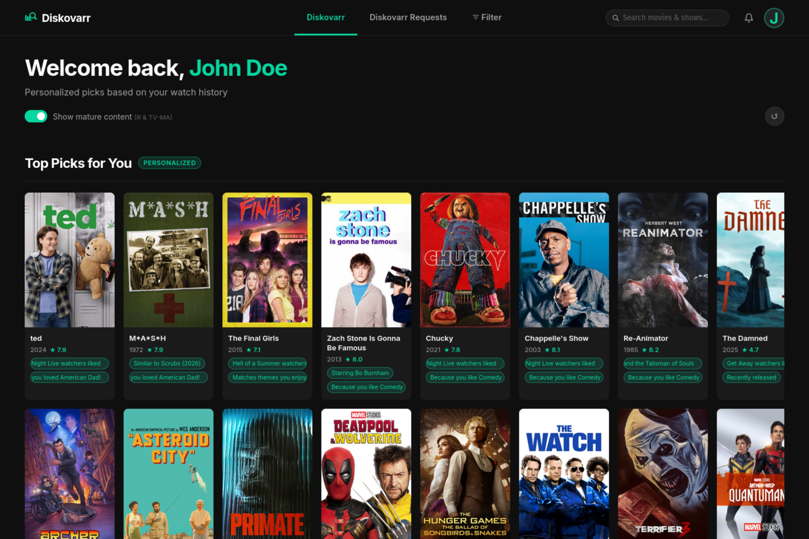

<div align="center">

#  Diskovarr

**Personalized Plex recommendations powered by your watch history**

Sign in with Plex · Browse curated picks · Request missing titles · Manage your library

</div>



---

## Tabs & Features

### Diskovarr (Home)
Personalized recommendations in four carousels — **Top Picks, Movies, TV Shows, Anime** — scored from your Tautulli watch history. Each section is a paginated 2-row carousel with a ↺ shuffle button. Scores factor in genre, director, cast, studio, decade, and star ratings. Cards show reason tags ("Because you like Sci-Fi", "Directed by X") and open a full detail modal with poster, Rotten Tomatoes scores, cast/director credits, and watchlist/dismiss actions.

### Requests
Content not yet in your Plex library, scored by the same preference engine. Requires a free TMDB API key and at least one request service (Overseerr, Radarr, or Sonarr). Cards show why each title was recommended; the Request button routes to whichever service is enabled. Unreleased titles are automatically excluded. When a requested title appears in the library, the requester gets a bell notification plus optional Discord and Pushover delivery.

### Filter (Diskovarr View)
Full library browser with filters for type, decade, genre, minimum rating, sort order, and watched status.

### Watchlist
Syncs to the native **Plex.tv Watchlist** by default. Server owners can switch to **Playlist mode** (a private server-side playlist) — useful when the Plex Watchlist triggers download automation like pd_zurg.

### Queue
Request queue for all users. Users view and manage their own requests. Admins and elevated users can approve, deny (with optional note), edit, or delete any request. Admins can set per-user request limits and auto-approve overrides.

### Issues
Report problems with library items directly from any detail modal — broken file, wrong metadata, audio sync, etc. TV shows include a scope selector: Entire Series, Specific Season, or Specific Episode. Submitted issues appear at `/issues`; admins resolve or close them with an optional note delivered back to the reporter as a notification.

### User Settings
Each user can configure: region, language, notification preferences (per event type), personal Discord User ID or Pushover key, and auto-request-from-watchlist options.

### Admin Panel
Two-tab panel at `/admin`:

- **Settings** — library sync controls, per-user watch sync, cache management, server owner, watchlist/playlist mode, theme color (8 presets + color wheel), app public URL, and full per-user settings with action buttons (re-sync, clear watched, clear dismissals, clear requests)
- **Connections** — configure Plex, Tautulli, TMDB, Overseerr, Radarr, Sonarr, Agregarr, and Riven/DUMB with masked API key fields, test buttons, and slide toggles — no file edits or restarts needed
- **Riven/DUMB torrent browser** — search any title, browse Torrentio results with Real-Debrid cache status, and inject a torrent directly into Riven from the admin panel. Includes a season selector for TV shows and manual magnet paste fallback.
- **DUMB request polling** — enable in Admin → Connections → Riven → DUMB Integration. Generates a dedicated API key; enter your Diskovarr URL and that key in DUMB as its Overseerr connection. In Pull mode DUMB polls `/api/v1/request?filter=approved` and marks content available when downloaded. In Push mode Diskovarr pushes IMDB IDs directly to Riven on approval (original behaviour).
- **Agregarr** — enable the Overseerr-compatible API shim so Agregarr can auto-request missing collection items through Diskovarr. Service users are created automatically; their requests appear in the queue with a bot badge.

---

## Notifications

Configure from **Admin → Notifications**. Multiple events of the same type within an hour are bundled into a single message ("Dune approved and 2 other titles"), with the first title's poster embedded full-width. External sends are skipped if the user already read the bell notification in-app.

**Discord** — two modes:
- *Webhook* — posts to a shared channel; users can optionally add a personal webhook for private delivery
- *Bot Token* — DMs each user directly; users enter their Discord User ID in their settings; an optional toggle also mirrors admin-type events to a shared channel webhook

**Pushover** — enter your Pushover app token and user/group key; per-user keys can be set in each user's settings for individual delivery.

**Event types:** request pending · auto-approved · approved · denied · available in library · processing failed · issue reported · issue status updated

---

## Requirements

- **[Docker](https://docs.docker.com/get-docker/)** (recommended) or Node.js ≥ 23.4.0
- **[Plex Media Server](https://www.plex.tv/media-server-downloads/)** — local network access required
- **[Tautulli](https://github.com/Tautulli/Tautulli)** — provides watch history used for preference scoring
- Optional: free [TMDB API key](https://www.themoviedb.org/settings/api) to enable the Requests tab
- Optional request routing: **[Overseerr](https://github.com/sct/overseerr)** · **[Radarr](https://github.com/Radarr/Radarr)** · **[Sonarr](https://github.com/Sonarr/Sonarr)**
- Optional collection management: **[Agregarr](https://github.com/agregarr/agregarr)**
- Optional torrent management: **[DUMB](https://github.com/I-am-PUID-0/DUMB)** (Riven + Real-Debrid) — torrent browser and request polling

> Diskovarr is designed for a single Plex server and its users. Users must be members of your configured Plex server — the app verifies membership during OAuth sign-in.

---

## Installation

### Docker (recommended)

```bash
curl -o docker-compose.yml https://raw.githubusercontent.com/Lebbitheplow/diskovarr/master/docker-compose.yml
# Edit environment variables in docker-compose.yml
docker compose up -d
```

Open `http://your-server:3232`. The library syncs from Plex on first startup (30–60 seconds). Subsequent starts load from the local cache instantly.

**Update:** `docker compose pull && docker compose up -d`

> The `./data` volume contains the SQLite databases — don't delete it between updates.

### Bare Metal (Node.js)

```bash
git clone https://github.com/Lebbitheplow/diskovarr
cd diskovarr
cp .env.example .env   # fill in your values
npm install
npm start
```

<details>
<summary>Run as a systemd service</summary>

```ini
[Unit]
Description=Diskovarr
After=network.target

[Service]
Type=simple
User=your-user
WorkingDirectory=/path/to/diskovarr
ExecStart=/usr/bin/node server.js
Restart=on-failure
RestartSec=5
EnvironmentFile=/path/to/diskovarr/.env
StandardOutput=journal
StandardError=journal

[Install]
WantedBy=multi-user.target
```

```bash
sudo systemctl daemon-reload
sudo systemctl enable --now diskovarr
```
</details>

---

## Configuration

### Required

| Variable | Description |
|---|---|
| `PLEX_URL` | Local URL of your Plex server, e.g. `http://192.168.1.x:32400` |
| `PLEX_TOKEN` | Plex admin token — used for library fetching and poster proxy |
| `PLEX_SERVER_ID` | Plex machine identifier (`http://your-plex:32400/identity` → `machineIdentifier`) |
| `PLEX_SERVER_NAME` | Display name shown in the OAuth sign-in flow |
| `ADMIN_PASSWORD` | Password for the `/admin` panel |
| `SESSION_SECRET` | Long random string used to sign session cookies |

### Optional

| Variable | Description |
|---|---|
| `TAUTULLI_URL` | Tautulli URL (can also be set in Admin → Connections) |
| `TAUTULLI_API_KEY` | Tautulli API key |
| `PLEX_MOVIES_SECTION_ID` | Movies library section ID (default: `1`) |
| `PLEX_TV_SECTION_ID` | TV/Anime library section ID (default: `2`) |
| `PORT` | Port to listen on (default: `3232`) |

> **Tip:** Plex, Tautulli, TMDB, Overseerr, Radarr, Sonarr, Agregarr, and Riven/DUMB can all be configured or updated from **Admin → Connections** without touching any files or restarting.

---

## License

MIT
