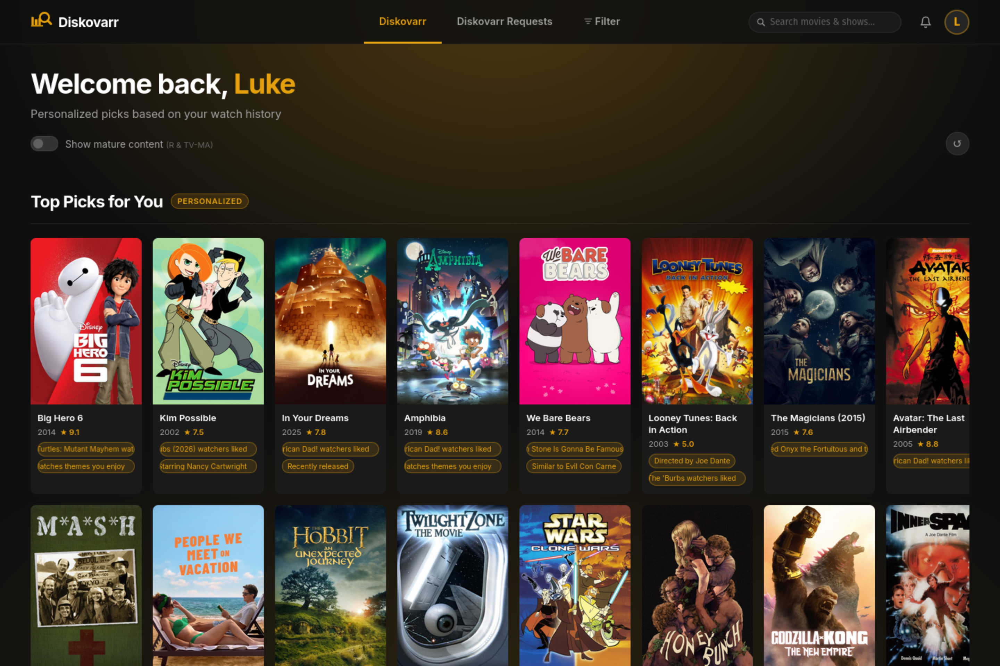

<div align="center">

#  Diskovarr

**Personalized media discovery and management platform for Plex**

Discover what to watch next · Review and rate content · Request missing titles · Automate your library

Sign in with Plex · Browse personalized feeds · Manage content lifecycle · Integrate with your stack

</div>



> **v2.0.0 — React Edition** is now the default release. The user-facing UI has been fully rewritten as a React SPA backed by the existing Express API. Existing Docker users can upgrade with a single `docker compose pull && docker compose up -d` — **all SQLite data, sessions, watch history, and admin settings are preserved**. See [Upgrading from v1.x](#upgrading-from-v1x) for details.

---

## Why Diskovarr

Diskovarr is the central hub for discovering, managing, and automating your Plex media library. It learns what you enjoy from your watch history, surfaces personalized recommendations, and gives you the tools to request, review, and automate content acquisition and retention.

### Personalized Discovery

* **Smart recommendations** — scored from your Tautulli watch history across genre, director, cast, studio, decade, and star ratings
* **Personalized feeds** — four curated carousels (Top Picks, Movies, TV Shows, Anime) that adapt as you watch
* **Recommendation context** — every suggestion includes reason tags so you understand why a title made the cut
* **Blacklists** — exclude genres, franchises, or specific titles to refine what surfaces in your feeds

### Reviews & Social

* **Ratings and reviews** — rate and write reviews for any title in your library
* **Social engagement** — comment on and react to other users' reviews
* **Shareable review cards** — generate share-ready cards with open graph images
* **Plex sync** — ratings sync back to your Plex profile

### Requests & Acquisition

* **Request workflows** — request missing content with full queue management, approvals, and status tracking
* **Overseerr-compatible API** — connect Agregarr, DUMB, Homarr, and any Overseerr-compatible tool
* **DUMB/Riven integration** — browse Torrentio results, check Real-Debrid cache status, and inject torrents directly
* **YouTube series via Tuberr** — search TVDB-only web series, request them with a "Download via YouTube" option, and let Sonarr grab episodes through yt-dlp (see [Tuberr](#tuberr-youtube-series-through-sonarr))
* **Auto-request automation** — set profiles that automatically request content matching your criteria

### Automation & Monitoring

* **Auto-request profiles** — define rules that automatically request content from your watchlist, recommendations, or other sources
* **Auto-delete profiles** — set criteria-based deletion rules for content no longer needed
* **Monitoring profiles** — track specific content, genres, or franchises and trigger actions when conditions are met
* **Library lifecycle management** — automate the full content lifecycle from discovery through acquisition to removal

### Administration

* **User management** — per-user settings, request limits, auto-approve overrides, and bulk actions
* **Notifications** — multi-channel delivery via Discord, Pushover, Telegram, Slack, Email, and more
* **Broadcasts** — compose rich-text announcements to all users from the admin panel
* **Connection management** — configure all integrations from the UI with no file edits or restarts

---

## Tabs & Features

### Diskovarr (Home)
Personalized recommendations in four carousels — **Top Picks, Movies, TV Shows, Anime** — scored from your Tautulli watch history. Each section is a paginated 2-row carousel with a ↺ shuffle button. Scores factor in genre, director, cast, studio, decade, and star ratings. Cards show reason tags ("Because you like Sci-Fi", "Directed by X") and open a full detail modal with poster, Rotten Tomatoes scores, cast/director credits, and watchlist/dismiss actions.

### Requests
Content not yet in your Plex library, scored by the same preference engine. Requires a free TMDB API key and at least one request service (Overseerr, Radarr, or Sonarr). Cards show why each title was recommended; the Request button routes to whichever service is enabled. Unreleased titles are automatically excluded. When a requested title appears in the library, the requester gets a bell notification plus optional Discord and Pushover delivery.

### Filter (Diskovarr View)
Full library browser with filters for type, decade, genre, minimum rating, and sort order. Watched items are always included and shown with a green checkmark badge on their poster.

### Watchlist
Syncs to the native **Plex.tv Watchlist** by default. Server owners can switch to **Playlist mode** (a private server-side playlist) — useful when the Plex Watchlist triggers download automation like pd_zurg.

### Queue
Request queue for all users. Users view and manage their own requests. Admins and elevated users can approve, deny (with optional note), edit, or delete any request. Filter tabs include All, Pending, Requested, Approved, Available (requests whose content has arrived in the library), and Denied. Column headers are clickable to sort by title, user, type, age, or status. **v2.0.0** adds server-side search and user/date-range filters across the full result set, plus bulk-select checkboxes for batch actions. Admins can set per-user request limits and auto-approve overrides.

### Issues
Report problems with library items directly from any detail modal — broken file, wrong metadata, audio sync, etc. TV shows include a scope selector: Entire Series, Specific Season, or Specific Episode. Submitted issues appear at `/issues`; admins resolve or close them with an optional note delivered back to the reporter as a notification. **v2.0.0** adds the same server-side search, filtering, and bulk-select tooling as the Queue page.

### Reviews
Write reviews and assign star ratings for any title in your library. Review the work of other users with threaded comments and reactions. Share standout reviews with generated open graph cards that render beautifully in chat apps and social feeds. Your ratings sync back to Plex, and your review history is available for browsing at any time.

### Watch History
Your watch history syncs from Tautulli and powers every recommendation Diskovarr makes. Browse what you've watched, track viewing statistics, and see how your preferences shape your personalized feeds. The more you watch, the better Diskovarr understands what you'll enjoy next.

### Blacklists
Fine-tune your recommendations by blacklisting genres, franchises, or specific titles you never want to see again. Blacklisted content is excluded from your recommendation feeds, request suggestions, and automated profiles, ensuring your discovery experience stays relevant.

### Automations
Set and forget your library management. Create auto-request profiles that automatically request content matching your criteria, auto-delete profiles that remove content no longer needed, and monitoring profiles that watch for specific conditions and trigger actions. Automations give admins full lifecycle control over content acquisition and retention without manual intervention.

### User Settings
Each user can configure: region, language, notification preferences (per event type), personal Discord User ID or Pushover key, auto-request-from-watchlist options, blacklist preferences, review settings, and personal monitoring profiles.

### Admin Panel
Two-tab panel at `/admin`:

- **Settings** — library sync controls, per-user watch sync, cache management, server owner, watchlist/playlist mode, theme color (8 presets + color wheel), app public URL, and full per-user settings with action buttons (re-sync, clear watched, clear dismissals, clear requests)
- **Connections** — configure Plex, Tautulli, TMDB, Overseerr, Radarr, Sonarr, and DUMB/Riven with masked API key fields, test buttons, and slide toggles — no file edits or restarts needed
- **DUMB/Riven torrent browser** — search any title, browse Torrentio results with Real-Debrid cache status, and inject a torrent directly into Riven from the admin panel. Includes a season selector for TV shows and manual magnet paste fallback.
- **DUMB request polling** — enable in Admin → Connections → DUMB/Riven → DUMB Integration. Enter your Diskovarr URL and the Overseerr Compat Key (Admin → General) in DUMB as its Overseerr connection. In Pull mode DUMB polls `/api/v1/request?filter=approved` and marks content available when downloaded. In Push mode Diskovarr pushes IMDB IDs directly to Riven on approval (original behaviour).
- **Overseerr-compatible API** — Diskovarr exposes a full Overseerr-compatible API at `/api/v1/`. Any app that supports Overseerr — including **Agregarr**, **DUMB**, and **Homarr** — can connect using your Diskovarr URL and the Overseerr Compat Key from Admin → General. Agregarr service accounts are created automatically; their requests appear in the queue with a bot badge. v2.0.0 significantly expanded this compatibility surface (40+ new endpoints).
- **Broadcast notifications (v2.0.0)** — a rich-text editor in the admin panel lets you compose announcements with bold, italic, strikethrough, and inline code. Markdown is automatically stripped or translated per-channel for Discord and Pushover.
- **Automation management** — create, edit, and monitor auto-request profiles, auto-delete profiles, and content monitoring rules from the admin panel. Configure triggers, criteria, and action targets without touching configuration files.

---

## Notifications

Configure from **Admin → Notifications**. Multiple events of the same type within an hour are bundled into a single message ("Dune approved and 2 other titles"), with the first title's poster embedded full-width. External sends are skipped if the user already read the bell notification in-app.

**Discord** — two modes:
- *Webhook* — posts to a shared channel; users can optionally add a personal webhook for private delivery
- *Bot Token* — DMs each user directly; users enter their Discord User ID in their settings; an optional toggle also mirrors admin-type events to a shared channel webhook

**Pushover** — enter your Pushover app token and user/group key; per-user keys can be set in each user's settings for individual delivery.

**Additional channels** — Telegram, Pushbullet, Email, WebPush, Webhook, Slack, Ntfy, and Gotify are also supported for broad notification coverage.

**Event types:** request pending · auto-approved · approved · denied · available in library · processing failed · issue reported · issue status updated · automation triggered · monitoring alert

> v2.0.0 adds Plex Server-Sent Events (SSE) for recently-added media detection, complementing the WebSocket sync introduced in v1.17.11.

---

## Requirements

Diskovarr integrates with your existing media stack to deliver personalized discovery, request management, and library automation. At minimum you need a Plex server and Tautulli for watch history. Optional integrations extend the platform into content acquisition, collection management, and torrent automation.

- **[Docker](https://docs.docker.com/get-docker/)** (recommended) or Node.js ≥ 23.4.0
- **[Plex Media Server](https://www.plex.tv/media-server-downloads/)** — local network access required
- **[Tautulli](https://github.com/Tautulli/Tautulli)** — provides watch history used for preference scoring
- Optional: free [TMDB API key](https://www.themoviedb.org/settings/api) to enable the Requests tab
- Optional request routing: **[Overseerr](https://github.com/sct/overseerr)** · **[Radarr](https://github.com/Radarr/Radarr)** · **[Sonarr](https://github.com/Sonarr/Sonarr)**
- Optional collection management: **[Agregarr](https://github.com/agregarr/agregarr)**
- Optional torrent management: **[DUMB](https://github.com/I-am-PUID-0/DUMB)** (Riven + Real-Debrid) — torrent browser and request polling

> Diskovarr is designed for a single Plex server and its users. Users must be members of your configured Plex server — the app verifies membership during OAuth sign-in.

---

## Installation

### Upgrading from v1.x

If you already run Diskovarr v1.x via Docker, the v2.0.0 upgrade is a drop-in:

```bash
docker compose pull && docker compose up -d
# or, for a plain `docker run` deployment:
docker pull lebbi/diskovarr:latest && docker restart diskovarr
```

The image name (`lebbi/diskovarr`), the exposed port (`3232`), and the persistent data volume (`/app/data`) are unchanged. Your SQLite database, sessions, watch history, and all admin settings are preserved. No `.env` changes are required.

A few things to know:

- **`PLEX_SERVER_NAME` is now optional.** The server name is auto-fetched from the Plex API. Leaving the variable in your `.env` or `docker-compose.yml` is harmless.
- **First load may be slow.** v2.0.0 introduces a new `discover_pool_cache` table that starts empty after upgrade; the home page may take 30–120 seconds to populate recommendations the first time, then is instant.
- **Sign in once.** The session cookie name changed; some users may need to sign in again after the first upgrade.
- **New optional env vars** — `TMDB_API_KEY` (Requests tab), `RIVEN_SETTINGS_PATH` (DUMB/Riven), and `APP_URL` (Plex OAuth callback URL when running behind a reverse proxy) are all optional. Set them only if you want the corresponding features.

### Docker Hub (easiest)

```bash
docker pull lebbi/diskovarr:latest

docker run -d --name diskovarr \
  -p 3232:3232 \
  -v $(pwd)/data:/app/data \
  -e SESSION_SECRET=changeme \
  -e ADMIN_PASSWORD=changeme \
  -e PLEX_URL=http://your-plex-ip:32400 \
  -e PLEX_TOKEN=your_plex_token \
  lebbi/diskovarr:latest
```

**Update:** `docker pull lebbi/diskovarr:latest && docker restart diskovarr`

### Docker Compose (recommended for production)

```bash
curl -o docker-compose.yml https://raw.githubusercontent.com/Lebbitheplow/diskovarr/master/docker-compose.yml
# Edit environment variables in docker-compose.yml
docker compose up -d
```

**Update:** `docker compose pull && docker compose up -d`

Open `http://your-server:3232`. The library syncs from Plex on first startup (30–60 seconds). Subsequent starts load from the local cache instantly.

> The `./data` volume contains the SQLite databases — don't delete it between updates.

### Bare Metal (Node.js)

v2.0.0 is a two-package layout: the React frontend at the repo root and the Express server under `server/`. Build the frontend once, then run the server.

```bash
git clone https://github.com/Lebbitheplow/diskovarr
cd diskovarr

# Install dependencies (frontend + backend)
npm install
cd server && npm install && cd ..

# Configure the backend
cp server/.env.example server/.env
# Edit server/.env and fill in your Plex credentials

# Build the React frontend
npm run build

# Start the server
cd server && node server.js
```

The app listens on `http://localhost:3232`.

<details>
<summary>Run as a systemd service</summary>

```ini
[Unit]
Description=Diskovarr
After=network.target

[Service]
Type=simple
User=your-user
WorkingDirectory=/path/to/diskovarr/server
ExecStart=/usr/bin/node server.js
Restart=on-failure
RestartSec=5
EnvironmentFile=/path/to/diskovarr/server/.env
StandardOutput=journal
StandardError=journal

[Install]
WantedBy=multi-user.target
```

```bash
sudo systemctl daemon-reload
sudo systemctl enable --now diskovarr
```
</details>

### Tuberr (YouTube series through Sonarr)

Tuberr is an optional companion service (in `tuberr/`) that lets Sonarr search and download YouTube web series — shows that have TVDB entries but no torrent/usenet releases. It presents itself to Sonarr as a **Torznab indexer** plus a **qBittorrent-compatible download client**, and downloads the actual videos with `yt-dlp`. Sonarr handles naming/import as usual, so files land in your library with proper `Series - SxxEyy - Title` names.

How it fits together:

1. You request a TV show in Diskovarr and pick **Download via: YouTube** (plus the source channel).
2. Diskovarr adds the series to Sonarr with the `yt` tag and registers a series↔channel mapping in Tuberr.
3. Tuberr matches TVDB episodes to channel videos (title/date/number/duration scoring, YouTube Data API). Review or correct matches via **Manage Series** in *Admin → Connections → YouTube (Tuberr)*.
4. Sonarr searches its `yt`-tagged indexer (Tuberr), grabs the fake "release", hands it to the Tuberr download client, yt-dlp downloads the video, and Sonarr imports it.

Setup — **Docker (zero extra steps)**: Tuberr is bundled in the Diskovarr image and starts with the container, pairing itself in Admin → Connections automatically (disable with `TUBERR_ENABLED=false`). Expose port 9832 so Sonarr can reach it, and mount a downloads dir Sonarr also sees (set `TUBERR_DOWNLOADS_DIR` to that path — same-path mounts in both containers avoid remote path mappings). Then the whole setup is: set the Tuberr address to a LAN IP Sonarr can reach, paste a YouTube API key, click **Set up Sonarr** (creates the tagged indexer + download client in Sonarr for you), and flip the toggle.

**Bare metal**:

```bash
cd tuberr && npm install
TUBERR_DOWNLOADS_DIR=/path/sonarr/can/read node server.js   # port 9832
# the API key is printed on first boot and saved to tuberr/data/api_key.txt
```

The same key authenticates both Diskovarr and Sonarr's Torznab indexer. You only need to fetch it from `api_key.txt` (or the log) once — after pairing Diskovarr, the Connections page can reveal and copy it, and **Set up Sonarr** handles the Sonarr side (the ⓘ icon on the YouTube section has the full step-by-step).

Requirements: Node ≥ 23.4 and a free YouTube Data API v3 key. **yt-dlp is self-managed** — Tuberr downloads the official standalone binary into `data/bin/` on first start and self-updates it daily (distro packages go stale and get 403'd by YouTube). Set `YTDLP_PATH` only if you want to manage your own binary. Mappings also refresh themselves every 6 hours (new TVDB episodes + new channel uploads are re-matched automatically), so monitored series pick up new episodes through Sonarr's regular RSS sync with no manual steps.

In **Sonarr** (both tagged `yt` so only YouTube series use them):
* *Settings → Download Clients → add qBittorrent*: host/port of Tuberr (9832), any username/password, category `tv-youtube`, tag `yt`.
* *Settings → Indexers → add Torznab*: URL `http://tuberr-host:9832/torznab`, API key = Tuberr's key, tag `yt`.

In **Diskovarr** (*Admin → Connections → YouTube (Tuberr)*): Tuberr address + API key, your YouTube Data API key, then flip the toggle. The toggle gates everything — TVDB search results, the YouTube downloader option, and the Manage Series view — so admins who don't want it can leave it off. Sonarr credentials and the YouTube key are pushed to Tuberr automatically when you save.

<details>
<summary>Run Tuberr as a systemd service</summary>

```ini
[Unit]
Description=Tuberr - YouTube downloader for Sonarr
After=network.target

[Service]
Type=simple
User=your-user
WorkingDirectory=/path/to/diskovarr/tuberr
ExecStart=/usr/bin/node server.js
Environment="TUBERR_DOWNLOADS_DIR=/path/sonarr/can/read"
Restart=on-failure
RestartSec=5
StandardOutput=journal
StandardError=journal

[Install]
WantedBy=multi-user.target
```
</details>

### Build the Docker image locally

```bash
docker build -t diskovarr:dev .
docker run --rm -p 3232:3232 \
  -v $(pwd)/data:/app/data \
  --env-file server/.env \
  diskovarr:dev
```

The root `Dockerfile` is a multi-stage build: stage 1 builds the React frontend with Vite, stage 2 bundles the build into the Express server runtime. The published `lebbi/diskovarr:latest` image is built the same way on a `v*` git tag via GitHub Actions.

---

## Configuration

All runtime settings are read by the Express server from environment variables. Bare-metal installs read them from `server/.env`; Docker users typically set them via `environment:` in `docker-compose.yml`. See `server/.env.example` for an annotated template.

### Required

| Variable | Description |
|---|---|
| `PLEX_URL` | Local URL of your Plex server, e.g. `http://192.168.1.x:32400` |
| `PLEX_TOKEN` | Plex admin token — used for library fetching and poster proxy |
| `PLEX_SERVER_ID` | Plex machine identifier (`http://your-plex:32400/identity` → `machineIdentifier`) |
| `ADMIN_PASSWORD` | Password for the `/admin` panel |
| `SESSION_SECRET` | Long random string used to sign session cookies (at least 32 chars recommended) |

### Optional

| Variable | Description |
|---|---|
| `PLEX_SERVER_NAME` | Display name for the OAuth sign-in flow. Auto-fetched from Plex if omitted. |
| `TAUTULLI_URL` | Tautulli URL (can also be set in Admin → Connections) |
| `TAUTULLI_API_KEY` | Tautulli API key |
| `PLEX_MOVIES_SECTION_ID` | Movies library section ID (default: `1`) |
| `PLEX_TV_SECTION_ID` | TV/Anime library section ID (default: `2`) |
| `PORT` | Port to listen on (default: `3232`) |
| `TMDB_API_KEY` | TMDB API key for metadata; enables the Requests tab |
| `RIVEN_SETTINGS_PATH` | Path to Riven `settings.json`; enables DUMB/Riven integration (default: `/opt/riven/settings.json`) |
| `APP_URL` | Public URL of your Diskovarr instance — used for the Plex OAuth callback when running behind a reverse proxy. Auto-detected if omitted. |

> **Tip:** Plex, Tautulli, TMDB, Overseerr, Radarr, Sonarr, and DUMB/Riven can all be configured or updated from **Admin → Connections** without touching any files or restarting.

---

## License

MIT
